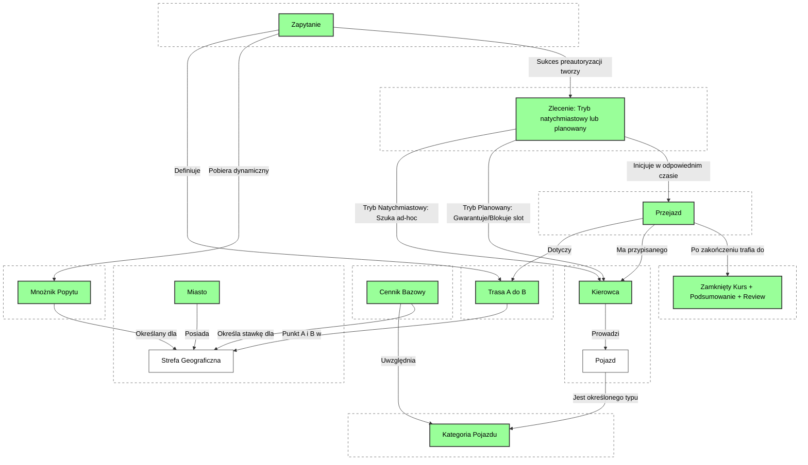

```mermaid
graph TD
    %% Definicje stylów z czarnym kolorem tekstu wewnątrz kafelków
    classDef root fill:#9f9,stroke:#333,stroke-width:2px,color:#000;
    classDef entity fill:#fff,stroke:#333,stroke-width:1px,color:#000;

    subgraph Cennik_Bazowy [Cennik Bazowy]
        CB[Cennik Bazowy]:::root
    end

    subgraph Kategoria_Aggregate [Kategoria Pojazdu]
        KP[Kategoria Pojazdu]:::root
    end

    subgraph Miasto_Aggregate [Miasto]
        M[Miasto]:::root
        S[Strefa Geograficzna]:::entity
        M -->|Posiada| S
    end

    subgraph Wycena_Dynamiczna [Cennik Dynamiczny]
        CD[Mnożnik Popytu]:::root
    end

    subgraph Pojazd_Aggregate [Kierowca i Pojazd]
        K[Kierowca]:::root
        P[Pojazd]:::entity
        K -->|Prowadzi| P
    end

    subgraph Trasa_Aggregate [Trasa]
        T[Trasa A do B]:::root
    end

    subgraph Zapytanie_Podstan [Zapytanie o Przejazd]
        ZAP[Zapytanie]:::root
    end

    subgraph Zlecenie_Podstan [Zlecenie Preautoryzowane]
        ZLE[Zlecenie: Tryb natychmiastowy lub planowany]:::root
    end

    subgraph Przejazd_Aggregate [Aktywny Przejazd]
        PR[Przejazd]:::root
    end

    subgraph Archiwum_Aggregate [Historia i Rozliczenie]
        HR[Zamknięty Kurs + Podsumowanie + Review]:::root
    end

    %% --- RELACJE STRUKTURALNE I CENOWE ---
    CB -->|Uwzględnia| KP
    P -->|Jest określonego typu| KP
    CD -->|Określany dla| S
    T -->|Punkt A i B w| S
    CB -->|Określa stawkę dla| S

    %% --- PRZEPŁYW BIZNESOWY ---
    ZAP -->|Definiuje| T
    ZAP -->|Pobiera dynamiczny| CD
    
    ZAP -->|Sukces preautoryzacji tworzy| ZLE
    
    %% Rozbicie logiki matchowania w zależności od trybu zlecenia
    ZLE -->|Tryb Natychmiastowy: Szuka ad-hoc| K
    ZLE -->|Tryb Planowany: Gwarantuje/Blokuje slot| K
    
    ZLE -->|Inicjuje w odpowiednim czasie| PR
    
    PR -->|Dotyczy| T
    PR -->|Ma przypisanego| K
    PR -->|Po zakończeniu trafia do| HR

    %% Style dla kontenerów (subgraph)
    style Cennik_Bazowy fill:none,stroke:#666,stroke-width:1px,stroke-dasharray: 5 5,color:#fff
    style Miasto_Aggregate fill:none,stroke:#666,stroke-width:1px,stroke-dasharray: 5 5,color:#fff
    style Pojazd_Aggregate fill:none,stroke:#666,stroke-width:1px,stroke-dasharray: 5 5,color:#fff
    style Kategoria_Aggregate fill:none,stroke:#666,stroke-width:1px,stroke-dasharray: 5 5,color:#fff
    style Wycena_Dynamiczna fill:none,stroke:#666,stroke-width:1px,stroke-dasharray: 5 5,color:#fff
    style Przejazd_Aggregate fill:none,stroke:#666,stroke-width:1px,stroke-dasharray: 5 5,color:#fff
    style Trasa_Aggregate fill:none,stroke:#666,stroke-width:1px,stroke-dasharray: 5 5,color:#fff
    style Zapytanie_Podstan fill:none,stroke:#666,stroke-width:1px,stroke-dasharray: 5 5,color:#fff
    style Zlecenie_Podstan fill:none,stroke:#666,stroke-width:1px,stroke-dasharray: 5 5,color:#fff
    style Archiwum_Aggregate fill:none,stroke:#666,stroke-width:1px,stroke-dasharray: 5 5,color:#fff
```
