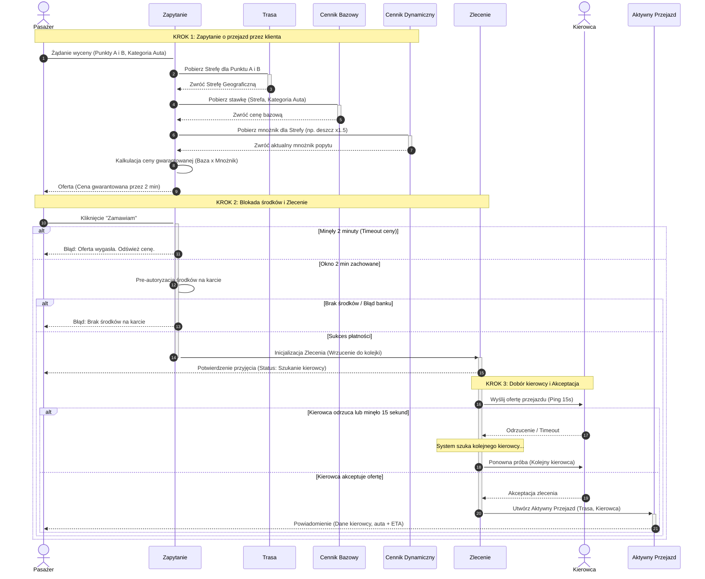

```mermaid
sequenceDiagram
    autonumber
    actor P as Pasażer
    participant ZAP as Zapytanie
    participant T as Trasa
    participant CB as Cennik Bazowy
    participant CD as Cennik Dynamiczny
    participant ZLE as Zlecenie
    actor K as Kierowca
    participant PR as Aktywny Przejazd

    %% --- ETAP 1: WYCENA (PROPOZYCJA CENY) ---
    Note over P, CD: KROK 1: Zapytanie o przejazd przez klienta
    P->+ZAP: Żądanie wyceny (Punkty A i B, Kategoria Auta)
    
    ZAP->+T: Pobierz Strefę dla Punktu A i B
    T-->>-ZAP: Zwróć Strefę Geograficzną
    
    ZAP->+CB: Pobierz stawkę (Strefa, Kategoria Auta)
    CB-->>-ZAP: Zwróć cenę bazową
    
    ZAP->+CD: Pobierz mnożnik dla Strefy (np. deszcz x1.5)
    CD-->>-ZAP: Zwróć aktualny mnożnik popytu
    
    ZAP->ZAP: Kalkulacja ceny gwarantowanej (Baza x Mnożnik)
    ZAP-->>P: Oferta (Cena gwarantowana przez 2 min)

    %% --- ETAP 2: ZLECENIE I PŁATNOŚĆ ---
    Note over P, ZLE: KROK 2: Blokada środków i Zlecenie
    P->+ZAP: Kliknięcie "Zamawiam"
    
    alt Minęły 2 minuty (Timeout ceny)
        ZAP-->>P: Błąd: Oferta wygasła. Odśwież cenę.
    else Okno 2 min zachowane
        ZAP->ZAP: Pre-autoryzacja środków na karcie
        
        alt Brak środków / Błąd banku
            ZAP-->>P: Błąd: Brak środków na karcie
        else Sukces płatności
            ZAP->>+ZLE: Inicjalizacja Zlecenia (Wrzucenie do kolejki)
            deactivate ZAP
            ZLE-->>P: Potwierdzenie przyjęcia (Status: Szukanie kierowcy)
            
            %% --- ETAP 3: MATCHOWANIE KIEROWCY ---
            Note over ZLE, K: KROK 3: Dobór kierowcy i Akceptacja
            ZLE->>+K: Wyślij ofertę przejazdu (Ping 15s)
            
            alt Kierowca odrzuca lub minęło 15 sekund
                K-->>ZLE: Odrzucenie / Timeout
                Note over ZLE: System szuka kolejnego kierowcy...
                ZLE->>K: Ponowna próba (Kolejny kierowca)
            else Kierowca akceptuje ofertę
                K-->>ZLE: Akceptacja zlecenia
                ZLE->>+PR: Utwórz Aktywny Przejazd (Trasa, Kierowca)
                deactivate ZLE
                PR-->>P: Powiadomienie (Dane kierowcy, auta + ETA)
                deactivate PR
            end
        end
    end
```
