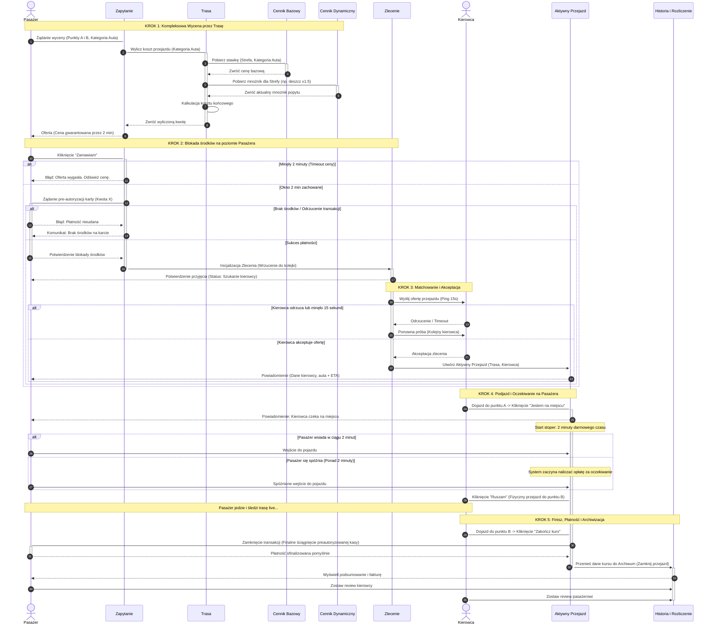

```mermaid
sequenceDiagram
    autonumber
    actor P as Pasażer
    participant ZAP as Zapytanie
    participant T as Trasa
    participant CB as Cennik Bazowy
    participant CD as Cennik Dynamiczny
    participant ZLE as Zlecenie
    actor K as Kierowca
    participant PR as Aktywny Przejazd
    participant HR as Historia i Rozliczenie

    %% --- ETAP 1: WYCENA (PROPOZYCJA CENY) ---
    Note over P, CD: KROK 1: Kompleksowa Wycena przez Trasę
    P->+ZAP: Żądanie wyceny (Punkty A i B, Kategoria Auta)
    
    ZAP->+T: Wylicz koszt przejazdu (Kategoria Auta)
    T->+CB: Pobierz stawkę (Strefa, Kategoria Auta)
    CB-->>-T: Zwróć cenę bazową
    
    T->+CD: Pobierz mnożnik dla Strefy (np. deszcz x1.5)
    CD-->>-T: Zwróć aktualny mnożnik popytu
    
    T->T: Kalkulacja kosztu końcowego
    T-->>-ZAP: Zwróć wyliczoną kwotę
    
    ZAP-->>P: Oferta (Cena gwarantowana przez 2 min)

    %% --- ETAP 2: ZLECENIE I PŁATNOŚĆ ---
    Note over P, ZLE: KROK 2: Blokada środków na poziomie Pasażera
    P->+ZAP: Kliknięcie "Zamawiam"
    
    alt Minęły 2 minuty (Timeout ceny)
        ZAP-->>P: Błąd: Oferta wygasła. Odśwież cenę.
    else Okno 2 min zachowane
        ZAP->+P: Żądanie pre-autoryzacji karty (Kwota X)
        
        alt Brak środków / Odrzucenie transakcji
            P-->>ZAP: Błąd: Płatność nieudana
            ZAP-->>P: Komunikat: Brak środków na karcie
        else Sukces płatności
            P-->>-ZAP: Potwierdzenie blokady środków
            
            ZAP->>+ZLE: Inicjalizacja Zlecenia (Wrzucenie do kolejki)
            deactivate ZAP
            ZLE-->>P: Potwierdzenie przyjęcia (Status: Szukanie kierowcy)
            
            %% --- ETAP 3: MATCHOWANIE KIEROWCY ---
            Note over ZLE, K: KROK 3: Matchowanie i Akceptacja
            ZLE->>+K: Wyślij ofertę przejazdu (Ping 15s)
            
            alt Kierowca odrzuca lub minęło 15 sekund
                K-->>ZLE: Odrzucenie / Timeout
                ZLE->>K: Ponowna próba (Kolejny kierowca)
            else Kierowca akceptuje ofertę
                K-->>ZLE: Akceptacja zlecenia
                ZLE->>+PR: Utwórz Aktywny Przejazd (Trasa, Kierowca)
                deactivate ZLE
                PR-->>P: Powiadomienie (Dane kierowcy, auta + ETA)
            end
        end
    end

    %% --- ETAP 4: REALIZACJA PRZEJAZDU ---
    Note over K, PR: KROK 4: Podjazd i Oczekiwanie na Pasażera
    K->+PR: Dojazd do punktu A -> Kliknięcie "Jestem na miejscu"
    PR-->>P: Powiadomienie: Kierowca czeka na miejscu
    
    Note over PR: Start stoper: 2 minuty darmowego czasu
    
    alt Pasażer wsiada w ciągu 2 minut
        P->>PR: Wejście do pojazdu
    else Pasażer się spóźnia (Ponad 2 minuty)
        Note over PR: System zaczyna naliczać opłatę za oczekiwanie
        P->>PR: Spóźnione wejście do pojazdu
    end
    
    K->PR: Kliknięcie "Ruszam" (Fizyczny przejazd do punktu B)
    Note over P, K: Pasażer jedzie i śledzi trasę live...
    
    %% --- ETAP 5: ZAKOŃCZENIE I HISTORIA ---
    Note over K, HR: KROK 5: Finisz, Płatność i Archiwizacja
    K->PR: Dojazd do punktu B -> Kliknięcie "Zakończ kurs"
    
    PR->+P: Zamknięcie transakcji (Finalne ściągnięcie preautoryzowanej kasy)
    P-->>-PR: Płatność sfinalizowana pomyślnie
    
    PR->>+HR: Przenieś dane kursu do Archiwum (Zamknij przejazd)
    deactivate PR
    
    HR-->>P: Wyświetl podsumowanie i fakturę
    
    %% Wymiana ocen (Reviews) bezpośrednio w obiekcie historycznym
    P->>HR: Zostaw review kierowcy
    K->>HR: Zostaw review pasażerowi
    deactivate HR
```
